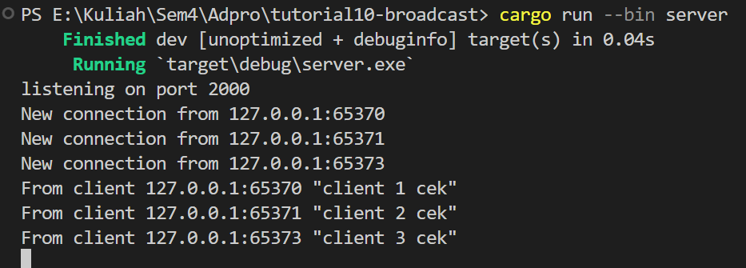
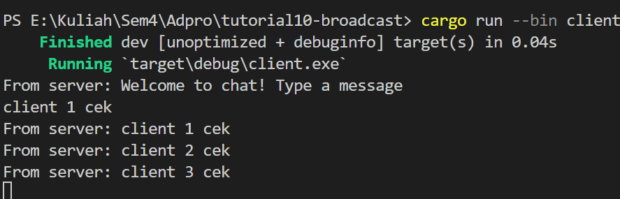
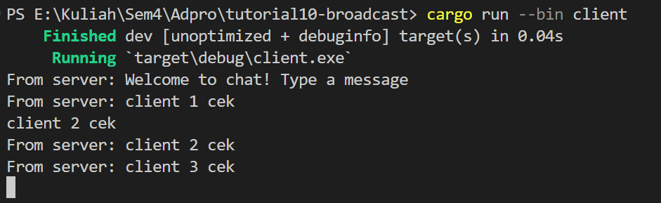
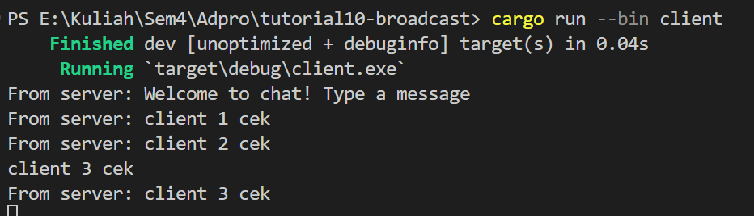
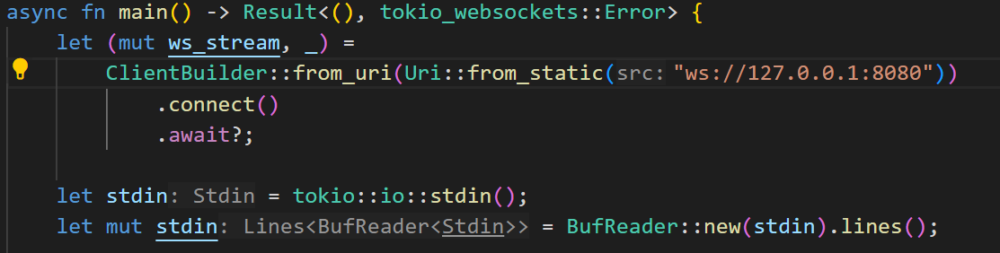
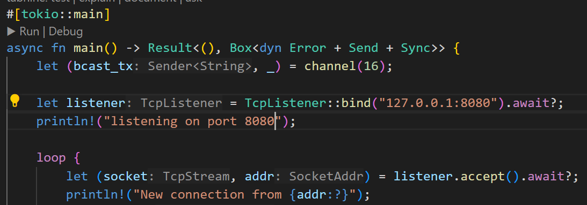
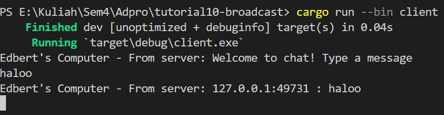
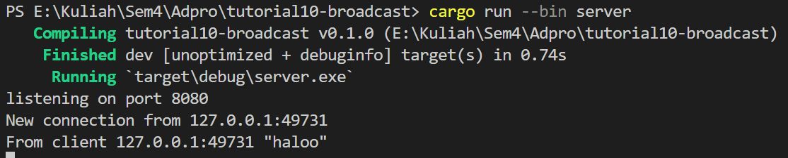

## 2.1 Original code of broadcast chat
#### Server

#### Client

 
To run, just run `cargo run --bin <file_name>`.

server akan menjadi listener dan menerima connection dari tiap client. DServer akan menerima dan memberikan message baru yang diberikan oleh client. Setiap client dapat membuat message dan menerima message dari client lain yang terkoneksi dan diproses oleh server.

## 2.2 Modifying the websocket port

Mengubah menjadi port 8080 pada file client.rs dan server.rs. Apliaksi akan berjalan dengan port yang sama. Protocol pada server.rs dan client.rs berbeda. Client.rs menggunakan websocket sedangkan server.rs menggunakana protocol TCP.

## 2.3: Small changes, add IP and Port

- Menambahkan informasi from Edbert's computer pada server dan client. Saya juga menambahkan bcast_tx.send(format!("{addr} : {text}"))?; agar memberikan pesan broadcast dengan format address dan text sehingga semua client mendapatkan informasi tiap address client lain yang memberikan text.

